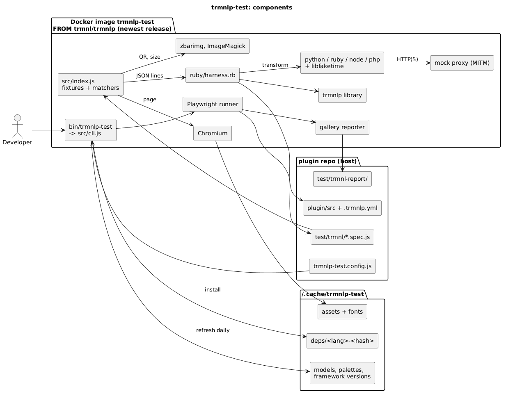
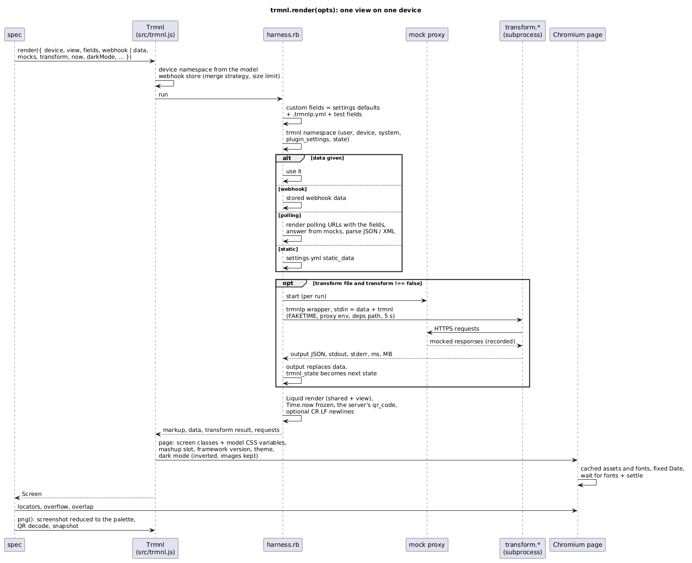
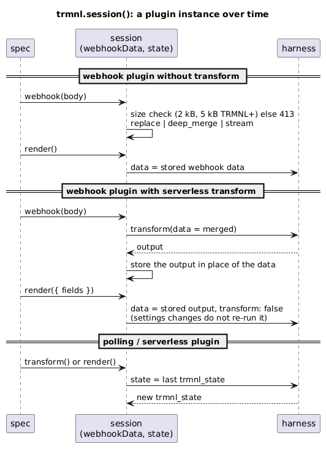
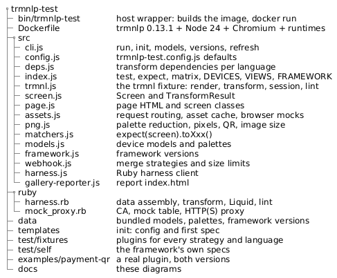

# How trmnlp-test works

Sources are the `.puml` files; regenerate the PNGs with
`docker run --rm -v $PWD:/d -w /d plantuml/plantuml -tpng *.puml`.

## Components

- `bin/trmnlp-test` starts the image with the plugin repo mounted at the same path and `~/.cache/trmnlp-test` as `/cache`.
- `src/cli.js` refreshes models, palettes and framework versions (daily), installs the transform dependencies, writes a Playwright config and runs it.
- Each Playwright worker owns one `ruby/harness.rb` and one Chromium. The harness loads trmnlp as a library and answers JSON-line requests.
- Specs only talk to the `trmnl` fixture and `expect` matchers from `src/index.js`.

## One render

1. **Data:** the custom fields are the `settings.yml` defaults, then `.trmnlp.yml`, then the test's fields. The source data is the test's data, the stored webhook data, a polling result answered by mocks, or `static_data`.
2. **Transform:** the plugin's `transform.*` runs in trmnlp's wrapper as a subprocess. It has a fixed clock (libfaketime), a 5 s timeout and the dependency paths. Its HTTP(S) goes through a per-run mock proxy, which records every request. Its output replaces the data, and `trmnl_state` becomes the next `trmnl.state`.
3. **Liquid:** `shared.liquid` + `<view>.liquid` are rendered with trmnlp's Liquid environment, with `Time.now` frozen.
4. **Page:** the hosted page markup is rebuilt with the screen classes from the model, palette and settings, the model's CSS variables, the mashup slot, the framework version and the theme. Assets and fonts come from the cache, and `Date` is fixed. Dark mode inverts the whole screen except images, as the server does (`'framework'`: the v3 class only).
6. **Where TRMNL differs:** `qr_code` returns the server's SVG by default (viewBox plus natural size and a max-width style, whatever the view argument); `crlf: true` renders the web editor's CR LF newlines. They are applied in the harness, so a test renders what TRMNL's server would.
5. **Assertions:** locators and geometry on the live page. `png()` is the screenshot reduced to the device palette (Floyd-Steinberg), used for pixels, QR codes (zbar), snapshots and the image size limit.

## Over time

`trmnl.session()` keeps what the hosted service keeps between events: the stored webhook data and `trmnl_state`. On a webhook plugin with a transform, the transform runs when data arrives and its output is stored. Renders do not re-run it.

## Structure

## Report

`<report>/index.html` lists every test with its device pictures, transform time and memory, and the problems found. It links to Playwright's report (`<report>/html`), which has traces, snapshot diffs and the page HTML of failed renders.
